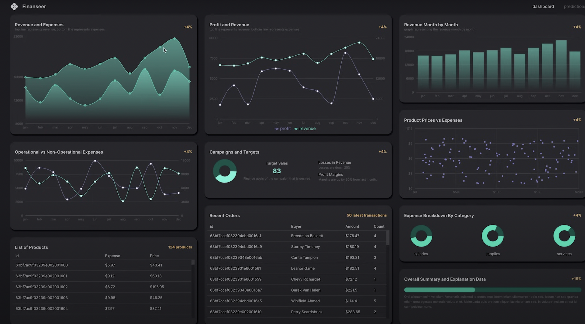

# Finance Dashboard App (MERN + Machine Learning)

A full-stack finance dashboard application with **machine learning predictions** for revenue and expenses.  
Built using the **MERN stack** (MongoDB, Express, React + TypeScript, Node.js) and modern frontend tooling.  

 

---

## 🚀 Tech Stack

### Frontend
- [React](https://reactjs.org/) + [TypeScript](https://www.typescriptlang.org/)
- [Vite](https://vitejs.dev/) – fast build & dev environment
- [Redux Toolkit](https://redux-toolkit.js.org/) – state management
- [Material UI (MUI)](https://mui.com/) – UI components
- [Recharts](https://recharts.org/) – charts and data visualization

### Backend
- [Node.js](https://nodejs.org/)
- [Express.js](https://expressjs.com/)
- [MongoDB](https://www.mongodb.com/) with [Mongoose](https://mongoosejs.com/)
- Machine learning logic for forecasting

---

## 📊 Features
- Interactive **finance dashboard** with KPIs
- **Machine learning predictions** for revenue & expenses
- Dynamic **charts and graphs**
- RESTful API with modular endpoints
- Scalable architecture (client + server separation)

---

## 🛠️ Getting Started

### Prerequisites
- [Node.js](https://nodejs.org/) (v18 or higher recommended)
- [MongoDB](https://www.mongodb.com/) (local or Atlas)

### 1. Clone the repository
```bash
git clone https://github.com/neverlinked/finance-mern-app.git
cd finance-mern-app
